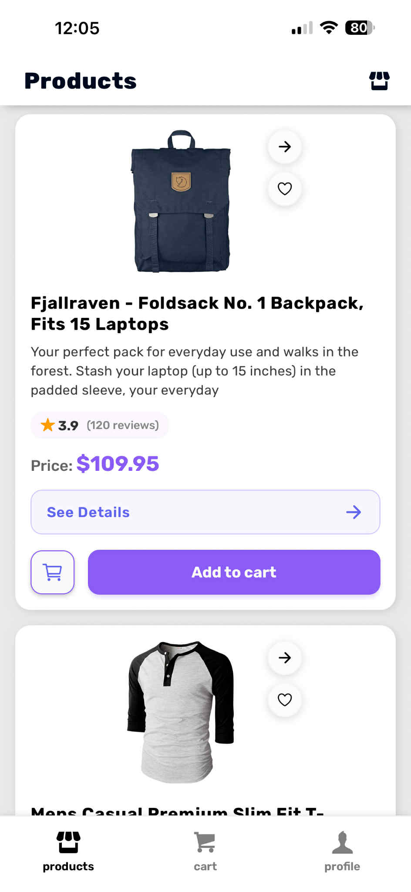
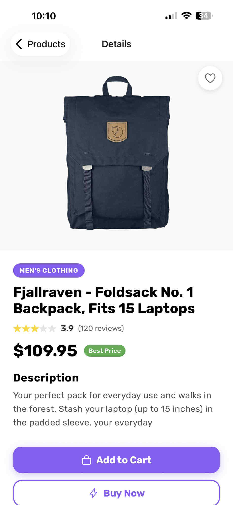
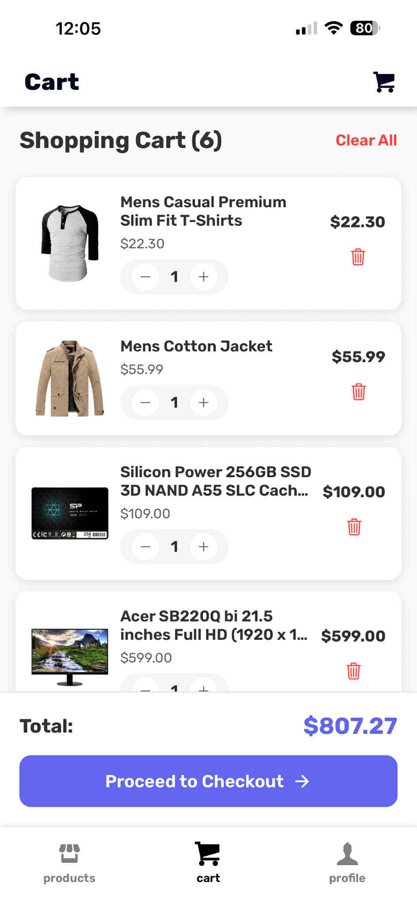

# 🛍️ React Mobile E-Commerce App

A modern, feature-rich mobile e-commerce application built with React Native, Expo and TypeScript. This app provides a seamless shopping experience with user authentication, product browsing, shopping cart functionality and user profile management.

<div align="center">

**📱 Cross-Platform** • **🔒 Secure Authentication** • **🛒 Shopping Cart** • **⚡ Fast Performance**

</div>

## 📱 Screenshots

<div align="center">
  
  
  
</div>

## ✨ Features

### 🔐 Authentication

- **User Login & Registration**: Secure authentication with form validation
- **Remember Me**: Option to keep users logged in across sessions
- **Token-based Authentication**: Using FakeStore API for authentication
- **Input Validation**: Real-time form validation with Yup schema

### 🛒 Shopping Experience

- **Product Catalog**: Browse products with detailed information
- **Product Details**: Comprehensive product view with images, ratings, and descriptions
- **Shopping Cart**: Add, remove, and manage cart items with quantity controls
- **Favorites**: Mark products as favorites (heart icon)
- **Search & Filter**: Easy product discovery

### 👤 User Profile

- **Profile Management**: View and manage user information
- **Swipeable Interface**: Modern carousel-style profile sections
- **Logout**: Secure session termination

### 🎨 UI/UX Features

- **Modern Design**: Clean, intuitive interface with custom icons
- **Smooth Animations**: Fluid transitions and interactions
- **Custom Fonts**: Rubik font family for consistent typography
- **Responsive Layout**: Optimized for various screen sizes
- **Loading States**: Elegant loading indicators throughout the app
- **Error Handling**: Graceful error states and user feedback

## 🛠️ Technology Stack

<div align="center">

### 🚀 Core Technologies


### 🎨 UI & Styling


### 🔧 State & Forms


### 🌐 APIs & Data


### 🔨 Development Tools


### 📱 Device Integration


</div>

### Technical Details

- **React Native**: Cross-platform mobile development framework
- **Expo**: Managed workflow with comprehensive tooling and services
- **TypeScript**: Full type safety across the entire codebase
- **Expo Router**: File-based navigation system with nested routes
- **AsyncStorage**: Persistent local storage for cart and user data
- **React Hook Form + Yup**: Advanced form handling with schema validation
- **Expo Vector Icons**: Ionicons and Feather icon libraries
- **Expo Image**: Optimized image loading and caching
- **FakeStore API**: RESTful API integration for e-commerce data

## 📁 Project Structure

```
react-mobile-final/
├── app/                          # App router pages
│   ├── (auth)/                   # Authentication screens
│   │   ├── index.tsx            # Login screen
│   │   ├── register.tsx         # Registration screen
│   │   └── _layout.tsx          # Auth layout
│   ├── (tabs)/                   # Tab navigation screens
│   │   ├── index.tsx            # Products listing (home)
│   │   ├── cart.tsx             # Shopping cart
│   │   ├── profile.tsx          # User profile
│   │   └── _layout.tsx          # Tab layout
│   ├── products/                 # Product details
│   │   ├── [id].tsx             # Dynamic product page
│   │   └── _layout.tsx          # Products layout
│   └── _layout.tsx              # Root layout
├── components/                   # Reusable components
│   ├── Products/                # Product listing component
│   └── ProductDetails/          # Product detail component
├── assets/                      # Static assets
│   └── images/                  # App images and screenshots
├── types/                       # TypeScript type definitions
├── utils/                       # Utility functions
└── Configuration files          # Package.json, tsconfig, etc.
```

## 🚀 Getting Started

### Prerequisites

- Node.js (v16 or higher)
- npm or yarn
- Expo CLI
- iOS Simulator or Android Emulator (optional)
- Expo Go app on your mobile device (for testing)

### Installation

1. **Clone the repository**

   ```bash
   git clone https://github.com/anakavtaradze1/react-mobile-final.git
   cd react-mobile-final
   ```

2. **Install dependencies**

   ```bash
   npm install
   # or
   yarn install
   ```

3. **Start the development server**

   ```bash
   npx expo start
   ```

4. **Run on your device or simulator**
   - Scan the QR code with Expo Go app (iOS/Android)
   - Press 'i' for iOS simulator
   - Press 'a' for Android emulator
   - Press 'w' for web browser

### Available Scripts

- `npm start` - Start the Expo development server
- `npm run android` - Start on Android emulator
- `npm run ios` - Start on iOS simulator
- `npm run web` - Start web version
- `npm run lint` - Run ESLint for code quality

## 📱 App Features in Detail

### Authentication Flow

The app includes a complete authentication system with:

- Form validation using Yup schemas
- Secure token storage with AsyncStorage
- Auto-login functionality with "Remember Me"
- Smooth navigation between auth states

### Product Management

- Real-time product data from FakeStore API
- Product categories and ratings
- High-quality product images with proper loading states
- Detailed product information including descriptions and reviews

### Shopping Cart

- Persistent cart storage across app sessions
- Quantity management with intuitive controls
- Cart total calculations
- Remove individual items or clear entire cart
- Smooth checkout flow preparation

### User Experience

- Consistent design language throughout the app
- Loading indicators for better user feedback
- Error handling with user-friendly messages
- Smooth animations and transitions

## 🔧 Configuration

### Environment Setup

The app uses Expo's managed workflow with the following key configurations:

- **Expo SDK**: Version ~54.0.22
- **React Native**: Version 0.81.5
- **TypeScript**: Fully typed codebase
- **Navigation**: Expo Router with file-based routing

### API Integration

The app integrates with FakeStore API for:

- User authentication
- Product catalog
- User profiles
- Mock e-commerce data

## 📊 Project Stats

<div align="center">

| Feature             | Status       | Description                      |
| ------------------- | ------------ | -------------------------------- |
| 🔐 Authentication   | ✅ Complete  | Login, Register, Remember Me     |
| 🛒 Shopping Cart    | ✅ Complete  | Add, Remove, Quantity Management |
| 👤 User Profile     | ✅ Complete  | Profile Info, Address, Logout    |
| 📱 Responsive UI    | ✅ Complete  | Works on all screen sizes        |
| 🎨 Modern Design    | ✅ Complete  | Clean, intuitive interface       |
| ⚡ Performance      | ✅ Optimized | Fast loading, smooth animations  |
| 🔄 State Management | ✅ Complete  | React Hooks + AsyncStorage       |
| 📡 API Integration  | ✅ Complete  | RESTful API with error handling  |

</div>

## 🎯 Key Highlights

<div align="center">

### 💡 Why This Project Stands Out

🚀 **Modern Architecture** - Built with latest React Native and Expo SDK  
🎨 **Professional UI/UX** - Clean design with smooth animations  
🔒 **Secure Authentication** - Token-based auth with form validation  
📱 **Cross-Platform** - Single codebase for iOS and Android  
⚡ **Performance Optimized** - Fast loading and responsive interface  
🛠️ **Developer Friendly** - TypeScript, ESLint, and clean code structure

</div>

## 👨‍💻 Development

### Code Style

- ESLint configuration for code consistency
- TypeScript for type safety
- Consistent file naming conventions
- Component-based architecture

### Best Practices

- Separation of concerns
- Reusable components
- Proper error handling
- Responsive design principles
- Performance optimization

---

<div align="center">

**Built with ❤️ using React Native and Expo**

</div>
